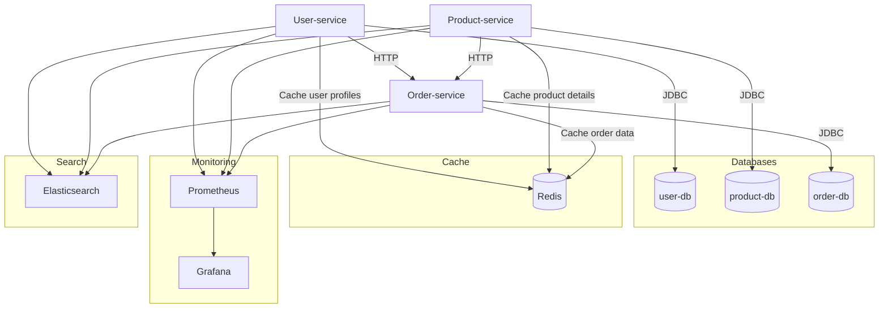

---

# 🛒 Order Simulation Project

Учебный микросервисный проект для моделирования оформления заказов в интернет-магазине.

---

## 📌 Описание

**Order Simulation Project** — система из трёх микросервисов (**Пользователи**, **Товары**, **Заказы**), которые взаимодействуют между собой через REST API. Каждый сервис использует свою базу данных PostgreSQL. Проект демонстрирует современные подходы к архитектуре микросервисов на базе Kotlin + Spring Boot.

---

## 🗂️ Архитектура



| Микросервис     | Порт | Назначение                |
| --------------- | ---- | ------------------------- |
| User-service    | 8082 | Управление пользователями |
| Product-service | 8081 | Управление товарами       |
| Order-service   | 8083 | Управление заказами       |

---

## 🧭 Swagger UI

Все микросервисы содержат встроенную документацию **Swagger** (OpenAPI), что позволяет удобно изучить и протестировать API прямо из браузера!

* **User-service:** [http://localhost:8082/swagger-ui.html](http://localhost:8082/swagger-ui.html)
* **Product-service:** [http://localhost:8081/swagger-ui.html](http://localhost:8081/swagger-ui.html)
* **Order-service:** [http://localhost:8083/swagger-ui.html](http://localhost:8083/swagger-ui.html)

> Через Swagger вы можете просматривать документацию, выполнять тестовые запросы, видеть все доступные эндпоинты и схемы данных.

---

## 🚀 Быстрый старт

### 🐳 Запуск через Docker Compose

> **Рекомендуется!** Всё автоматически.

1. Соберите JAR-файлы для всех сервисов:

   ```bash
   ./gradlew build
   ```

   (Выполнить в каждой папке сервиса)

2. Запустите всё командой:

   ```bash
   docker-compose up --build
   ```

3. Откройте сервисы:

   * [User-service Swagger](http://localhost:8082/swagger-ui.html)
   * [Product-service Swagger](http://localhost:8081/swagger-ui.html)
   * [Order-service Swagger](http://localhost:8083/swagger-ui.html)

---

### 🖥️ Локальный запуск

1. Создайте три базы данных PostgreSQL:
   `userdb`, `productdb`, `orderdb`.

2. В каждом сервисе пропишите переменные окружения (или укажите в `application.properties`):

   ```properties
   SPRING_DATASOURCE_URL=jdbc:postgresql://localhost:5432/userdb
   SPRING_DATASOURCE_USERNAME=postgres
   SPRING_DATASOURCE_PASSWORD=postgres
   ```

   (для каждого сервиса — свой db)

3. Соберите и запустите сервисы:

   ```bash
   ./gradlew build
   java -jar build/libs/<service>-0.0.1-SNAPSHOT.jar
   ```

   (Порты: 8081, 8082, 8083)

4. Swagger UI будет доступен на соответствующих портах каждого сервиса.

---

## 📚 API-эндпоинты

| Микросервис     | Swagger UI         | Базовый URL             |
| --------------- | ------------------ | ----------------------- |
| User-service    | `/swagger-ui.html` | `http://localhost:8082` |
| Product-service | `/swagger-ui.html` | `http://localhost:8081` |
| Order-service   | `/swagger-ui.html` | `http://localhost:8083` |

**Примеры:**

<details>
<summary><b>Пользователи</b> (User-service)</summary>

* `GET /users` — список пользователей
* `GET /users/{id}` — пользователь по id
* `POST /users` — создать пользователя
* `DELETE /users/{id}` — удалить пользователя

</details>

<details>
<summary><b>Товары</b> (Product-service)</summary>

* `GET /products` — список товаров
* `GET /products/{id}` — товар по id
* `POST /products` — создать товар
* `DELETE /products/{id}` — удалить товар

</details>

<details>
<summary><b>Заказы</b> (Order-service)</summary>

* `GET /orders` — список заказов
* `GET /orders/{id}` — заказ по id
* `POST /orders` — создать заказ
* `DELETE /orders/{id}` — удалить заказ

</details>

---

## ⚙️ Переменные окружения

| Переменная                   | Описание                | Пример значения                           |
| ---------------------------- | ----------------------- | ----------------------------------------- |
| `SPRING_DATASOURCE_URL`      | Строка подключения к БД | `jdbc:postgresql://localhost:5432/userdb` |
| `SPRING_DATASOURCE_USERNAME` | Пользователь БД         | `postgres`                                |
| `SPRING_DATASOURCE_PASSWORD` | Пароль БД               | `postgres`                                |

---

## 💡 Пример использования

```bash
# Создать пользователя
curl -X POST http://localhost:8082/users \
  -H "Content-Type: application/json" \
  -d '{"email":"alice@example.com","password":"12345","name":"Alice"}'

# Создать товар
curl -X POST http://localhost:8081/products \
  -H "Content-Type: application/json" \
  -d '{"name":"Laptop","description":"Gaming","price":1000.0}'

# Создать заказ
curl -X POST http://localhost:8083/orders \
  -H "Content-Type: application/json" \
  -d '{"userId":1,"productId":1,"quantity":2}'
```

---

## 📝 Лицензия и автор

> Лицензия: *не указана*
> Автор: [ult1mq (Егор)](https://github.com/ult1mq)

---

**💬 Вопросы? — Создайте Issue или пишите автору в GitHub!**

---
